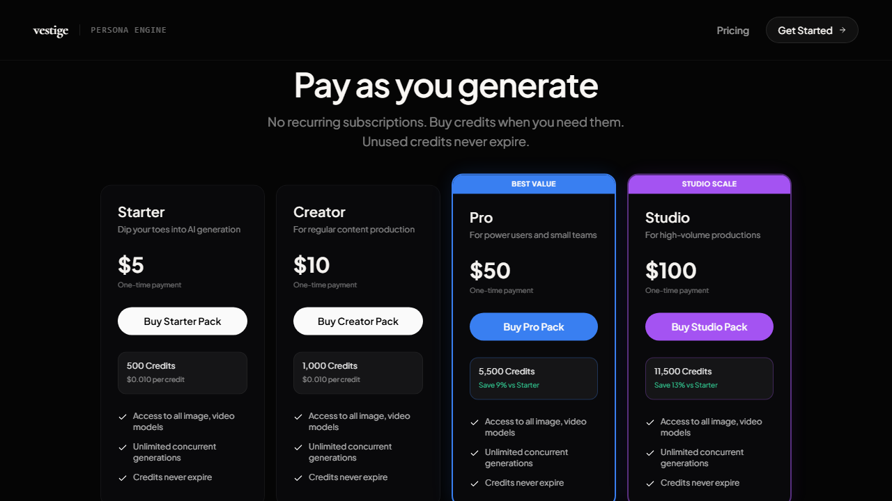

# Persona Engine - Production AI Workflow SaaS

TL;DR stack: Next.js 15 + React 19, NestJS 10 + Prisma/PostgreSQL, Supabase Auth/Realtime, Stripe Billing, Google Cloud Run, Vercel, GitHub Actions.

I built Persona Engine to help creators generate image/video content from reusable node-based workflows, with built-in credit billing and production-grade deployment.

- Live app: `https://persona-web-kohl.vercel.app`
- API health: `https://persona-api-cahsiez3nq-ue.a.run.app/api/v1/health`

## What I Built (1-Minute Overview)

- Built and launched a full-stack AI SaaS (Next.js + NestJS) from product UX to cloud deployment.
- Shipped a React Flow studio that turns prompt/media logic into reusable nodes (prompt lists, image lists, multi-shot prompts, identity vault).
- Implemented asynchronous generation orchestration with idempotent jobs, SSE status streaming, and polling fallback.
- Added Stripe credit monetization with webhook-based credit settlement and replay-safe idempotency controls.
- Deployed production on Vercel (web) and Google Cloud Run (api) with GitHub Actions CI/CD and documented rollout runbooks.

## Impact

- Problem: creators often manage prompting, generation, and assets across disconnected tools.
- Solution: Persona Engine unifies that workflow into one studio with reusable creative building blocks and built-in billing.
- Technical complexity: the product combines workspace-scoped auth, async job processing, realtime sync, and idempotent payment settlement across split deployments.

## Product Capabilities

- Supabase-authenticated studio experience (Google OAuth)
- Node-based workflow canvas for text/image/video pipelines
- Kie.ai-powered generation orchestration
- Workspace spaces and Kling elements library management
- Billing dashboard with credit purchases and transaction history
- Admin tooling for KPIs, provider key management, and system logs

## Visual Proof

Captured from the live deployment:




## Architecture Snapshot

- `apps/web` - Next.js 15 + React 19 frontend
- `apps/api` - NestJS 10 + Prisma backend
- `packages/types` - shared TypeScript package
- Supabase - authentication and realtime sync
- PostgreSQL - durable workflow and billing data
- Hosting split - Vercel (web) + Google Cloud Run (api)

## Tech Stack

- Frontend: Next.js 15, React 19, Tailwind CSS, Zustand, React Flow
- Backend: NestJS 10, Prisma, PostgreSQL, Stripe SDK
- Auth and Realtime: Supabase
- Cloud: Google Cloud (Cloud Run, Artifact Registry, Secret Manager)
- CI/CD: GitHub Actions (`.github/workflows/ci.yml`, `.github/workflows/deploy.yml`)

## Environment Split (Dev / Staging / Prod)

Use dedicated resources per environment. Do not share prod DB/API with dev work.

- API templates:
  - Dev: `apps/api/.env.dev.example`
  - Staging: `apps/api/.env.staging.example`
  - Prod: `apps/api/.env.prod.example`
- Web templates:
  - Dev: `apps/web/.env.dev.example`
  - Staging: `apps/web/.env.staging.example`
  - Prod: `apps/web/.env.prod.example`

Recommended mapping:

- Dev: local web + branch-safe dev API + dev DB
- Staging: deployed web + staging API + staging DB
- Prod: deployed web + production API + production DB

## Local + Cloud Dev Workflow (No Local DB / No Docker)

This flow is designed for your current setup where the local machine cannot run Docker and cannot reach DB directly.

1. Create a branch and push it.
2. `Deploy Dev API` workflow auto-runs and deploys a branch-safe Cloud Run service.
3. Copy `Base URL` from workflow logs.
4. In local web env, set `NEXT_PUBLIC_API_URL=<base-url>/api/v1`.
5. Run local web and test against cloud dev API:
   - `npm run dev:web`

One-command preview trigger:

```bash
git push origin <your-branch>
```

## GitHub Actions: Dev vs Prod

- Dev API preview: `.github/workflows/deploy-dev.yml`
  - Trigger: push to any non-`main` branch
  - Deploy target: `persona-api-dev-<branch>` Cloud Run service
  - Secrets prefix: `DEV_*`
- Dev API cleanup: `.github/workflows/cleanup-dev-services.yml`
  - Trigger: branch delete, merged PR to `main`, or manual dispatch
  - Action: deletes `persona-api-dev-<branch>` Cloud Run service when present
  - Manual run: provide `branch` input to target a specific branch service
- Production deploy: `.github/workflows/deploy.yml`
  - Trigger: push to `main`
  - Deploy targets: production API service + production Vercel web
- CI checks: `.github/workflows/ci.yml`
  - Trigger: PR to `main` and push to `main`

Required GitHub secrets for `Deploy Dev API`:

- `DEV_GCP_PROJECT_ID`
- Auth (choose one mode):
  - `DEV_WIF_PROVIDER` and `DEV_WIF_SERVICE_ACCOUNT`, or
  - `DEV_GCP_CREDENTIALS_JSON`
- Migration DB connections:
  - `DEV_DATABASE_URL`
  - `DEV_DIRECT_URL`

Required Google Secret Manager secrets consumed by Cloud Run deploy:

- `DEV_DATABASE_URL`
- `DEV_DIRECT_URL`
- `DEV_JWT_SECRET`
- `DEV_SUPABASE_URL`
- `DEV_SUPABASE_ANON_KEY`
- `DEV_REDIS_URL`
- `DEV_STRIPE_SECRET_KEY`
- `DEV_STRIPE_WEBHOOK_SECRET`

## Documentation

- Full app documentation: `docs/app-documentation.md`
- Deployment execution plan: `docs/plans/2026-02-22-gcp-mcp-gcloud-execution-plan.md`
- Dry-run runbook: `docs/plans/2026-02-22-t1-dry-run-runbook.md`
- Staging runbook: `docs/plans/2026-02-22-t2-staging-runbook.md`
- Deployment checklist: `docs/plans/2026-02-22-deployment-checklist.md`

## Resume-Ready Highlights

- Built and launched a full-stack AI SaaS using Next.js, NestJS, Prisma, and Supabase with a node-based workflow studio and Stripe credit monetization.
- Implemented asynchronous media orchestration with idempotent execution, SSE status streaming, polling fallback, and provider API-key load balancing.
- Shipped a production split deployment (Vercel + Google Cloud Run) with CI/CD automation, migration handling, rollout runbooks, and webhook idempotency validation.
